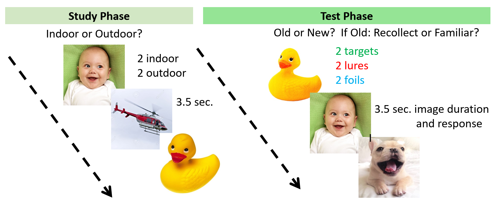

## What is Rmarkdown?
Rmarkdown is a great tool for authoring and presenting coding frameworks with an audience.
It allows a more text friendly environment for explaining and structuring step-by-step coding experience.
You can easily convert an .Rmd file into a html page or a PDF/word file by using the "Knit" button.
Note: Knitting will only work when there is no error in your code.


## Learning Objectives:
(1) Clean and organize the .csv output file
(2) Plot data results using ggplot2
(3) Do statistical analysis (e.g., t-test, ANOVA, linear regression, correlation)


## Set up a local folder for this lecture (can be downloaded from Quercus)

Inside your lecture folder, you should have:
1. A folder called "complete_data" containing 6 participants output files
2. R_data_analysis_workshop.Rmd
3. Paradigm_figure.PNG
4. Signal_detection_grid.png


## Installing required packages

Tidyverse includes dplyr, ggplot2, etc.

More on tidyverse: <https://www.tidyverse.org/packages/>


```{r setup, include=FALSE}
getwd()
knitr::opts_chunk$set(echo = TRUE)
#install.packages("knitr")
#install.packages("ggstatsplot") 
library(tidyverse)
library(stats)
library(ggplot2)
library(ggstatsplot)

```


## Data collection paradigm

```{r paradigm image, echo=FALSE, out.width = "50%", fig.align = "center"}
getwd()

knitr::include_graphics("complete_data/Paradigm_figure.PNG")

```


## Read in csv output file

Before we read it into our R environment, take a look at the .csv file o

Let's start with reading in one participant's file!

```{r reading file}

# define the path to where you put your downloaded dataset on your local computer
path <- "~/Downloads/complete_data/"

paste0(path, "349231_Scene_Recog_Nov10_2023-11-18_20h39.04.202.csv")

## read in the .csv output file
this_subj <- read_csv(paste0(path, "349231_Scene_Recog_Nov10_2023-11-18_20h39.04.202.csv"))

## take a look at this dataframe
## It might be easier to inspect your data as a csv file locally
head(this_subj, 10)

## What columns do we have in the dataframe?
colnames(this_subj)

```

### Piping allows for a more readable sturcture of coding.

What is piping in R coding? 

Imagine the piping symbol, %>%, as an actualy pipe/tube/tunnel. 
This pipe will send the object before it to the location after it.

This piping symbol can be generated by pressing 

"Command", "Shift", and "M" keys on Mac

"Control", "Shift", and "M" keys on Windows 


```{r piping}

head(this_subj, 5)

this_subj %>% head(.,5)

5 %>% 
  head(this_subj,.)

colnames(this_subj)

this_subj %>% 
colnames(.)

## How to code without piping
print(colnames(this_subj))
## How to code with piping
this_subj %>% colnames() %>% print()

## Instead of the inside to outside coding logic, piping allows the stucture of the code to be intuitively left to right, just like English reading.

```


## What columns do we need to keep?

Key function: dplyr::select -> select columns to keep

List out the columns you want to keep:

Participant ID, Age, probe type (lure, foil, target), phase (study vs. test), block, 
the key pressed, the correct key, response accuracy, response reaction time

```{r select columns to keep}

# take a look at the function "select"
?dplyr::select

## selecting columns
this_subj_cl <- 
  this_subj %>% 
  dplyr::select(participant, Age, probe, phase, block, # the important identification
                Study_IndoorOutdoor_resp.keys, scene_study_corr, Study_IndoorOutdoor_resp.corr, Study_IndoorOutdoor_resp.rt, # study response
                Test_OldNew_resp.keys, scene_test_corr, Test_OldNew_resp.corr, Test_OldNew_resp.rt, # test response
                Test_RK_resp.keys, Test_RK_resp.rt) # recollection vs. recognition response

## Look at the dataframe now. So much cleaner! We only have 15 columns left
head(this_subj_cl)

## check data type of each column
str(this_subj_cl)

## change participant to data type charactor
this_subj_cl$participant <- as.character(this_subj_cl$participant)
## A good practice to put categorical variables as factor
this_subj_cl$Age <- as.factor(this_subj_cl$Age)
this_subj_cl$probe <- as.factor(this_subj_cl$probe)
this_subj_cl$Study_IndoorOutdoor_resp.corr <- as.factor(this_subj_cl$Study_IndoorOutdoor_resp.corr)
this_subj_cl$Test_OldNew_resp.corr <- as.factor(this_subj_cl$Test_OldNew_resp.corr)
str(this_subj_cl)

```


## Now that we only kept the important columns, let's filter to keep the rows we want!

Key function: dplyr::filter -> keep rows that meet a condition

```{r filter out rows}

## take a look at some useful functions
?dplyr::filter
?grepl # advanced filtering

## filtering to keep rows that are NOT practice
this_subj_demo <- this_subj_cl %>% 
  dplyr::filter(!grepl("prac", phase)) 

## filtering out rows with NA in the phase column
this_subj_demo <- this_subj_demo %>% 
  dplyr::filter(!is.na(phase))

## You can also combine the above 2 steps into 1
this_subj_cl <- this_subj_cl %>% 
  dplyr::filter(!grepl("prac", phase)) %>% 
  dplyr::filter(!is.na(phase))

```

## Using what we learned about selecting columns and filtering rows. Let's separate Study and Test data into 2 different dataframes!

Try it out!

```{r separate study and test}

### Let's start with creating the study phase dataframe
## Hint: We can use the "phase" column to filter rows corresponding to the study phase
this_study <- this_subj_cl %>% 
  filter(phase == "study")
  

## But, you may notice that the study dataset still has many test phase columns
## We can select the columns we want!
## Hint: Much like the grepl() function when filtering, we can used the contains() function to detect a certain string when selecting columns
this_study <- this_study %>% 
  dplyr::select(!contains("test", ignore.case = TRUE))
  

## Now that we have the study dataframe, similarly, create the test dataframe
this_test <- this_subj_cl %>% 
  dplyr::filter(phase == "test") %>% 
  dplyr::select(!contains("study", ignore.case = TRUE))

```


## Now that we have the participant's cleaned study and test phase data, let's do some exploratory plots.

```{r exploratory plots}

## We can plot the relationship between indoor/outdoor pictures and reaction time in the study phase
## boxplot(y-axis, x-axis)
boxplot(this_study$Study_IndoorOutdoor_resp.rt ~ this_study$scene_study_corr)

## We can also use this amazing plotting package included in tidyverse called "ggplot2"
## look at the function ggplot
?ggplot

ggplot(this_study, aes(x=scene_study_corr, y=Study_IndoorOutdoor_resp.rt)) + # the aesthetic mappings
  geom_boxplot() + # specifying the type of plot to use
  theme_bw() # changing the background

## changing x and y axis
ggplot(this_study, aes(y=scene_study_corr, x=Study_IndoorOutdoor_resp.rt)) + 
  geom_boxplot() +
  theme_bw() +
  coord_flip()

## change box color for different groups
ggplot(this_study, aes(x=scene_study_corr, y=Study_IndoorOutdoor_resp.rt, fill=scene_study_corr)) + 
  geom_boxplot() +
  theme_classic() +
  scale_fill_brewer(palette="Pastel2")


## More customization ...
ggplot(this_study, aes(x=scene_study_corr, y=Study_IndoorOutdoor_resp.rt, fill=scene_study_corr)) + 
  geom_boxplot() +
  theme_classic() + 
  ggtitle("Plot of reaction time by indoor/outdoor image type") + # adding graph name
  xlab("Image type (indoor vs outdoor)") + # changing x axis name
  ylab("Reaction time (s)") + # changing y axis name
  theme(plot.title = element_text(color="black", size=14, face="bold.italic", hjust = 0.1), # 
    axis.title.x = element_text(color="blue", size=14, face="bold"),
    axis.title.y = element_text(color="#993333", size=14, face="bold")) +
  scale_fill_brewer(name = "Image type", labels = c("Indoor", "Outdoor"), palette="Pastel2")


```

R palettes:
<https://r-graph-gallery.com/38-rcolorbrewers-palettes.html>


```{r exploratory plots cont}

## We can plot the accuracy performance of the 3 probe types in test phase
this_test %>%
ggplot(aes(x=Test_OldNew_resp.corr, fill = Test_OldNew_resp.corr)) +
  geom_bar() +
  facet_wrap(~probe) +
  theme_bw() +
  ggtitle("Accuracy across probe types") +
  xlab("Correct (1) or Incorrect (0)") +
  ylab("Number of trials") +
  scale_fill_brewer(palette = "Set2")
  

## Now, try to
# (1) add graph title
# (2) change the names of the x and y axis
# (3) plot the bar graphs with different colors based on corr/incorr or probe type
# (4) Play with different R color palettes. Make it pretty :D


```


## Now that you know how to deal with one participant's dataset, we would want to efficiently do the same processing to all of the participants

### Introducing the idea of a for loop


```{r intro to loop}

## Say we want to print out the variable n, while updating the variable n to carry different values
n <- 1
print(n)

n <- 2
print(n)


for (n in 1:10) {
  print(n)
}

# Or
numbers <- 1:10

for (n in numbers) {
  print(n)
}

n

names <- c("Nick", "Christina", "batman")

for (n in names) {
  print(n)
  this_name <- n
}

# what is this_name after running the previous for loop?
this_name

for (n in names) {
  print(paste0("Hello ", n))
}

```

for (vairable in list) {
  action
}

Now, using the concept of a for loop, loop through the file names we want to read in.


```{r looping through file names}

## First, what are the file names we want to loop through?
file_names <- c("349231_Scene_Recog_Nov10_2023-11-18_20h39.04.202.csv","786438_Scene_Recog_Nov10_2023-11-18_21h03.08.361.csv","789854_Scene_Recog_Nov10_2023-11-18_20h36.25.864.csv","841215_Scene_Recog_Nov10_2023-11-18_21h06.25.482.csv","batman_Scene_Recog_Nov10_2023-11-18_21h07.31.819.csv","spiderman_Scene_Recog_Nov10_2023-11-18_21h03.37.033.csv")

# or use the list.files function in base R
file_names <- list.files(path = path, pattern = ".csv")

for (this_file in file_names) {
  this_subj <- read_csv(paste0(path, this_file))
}

## What is the dataframe this_subj now?

## A little note on "assign"
## Allows you to assign a new variable name to an existing variable
?assign
assign("his_name", n)

## Now, loop through file names while assigning each file to a new variable name so that it won't be overwritten
# Initiating a variable called cnt as 0
cnt <- 0
for (this_file in file_names) {
  cnt <- cnt + 1 # add 1 to cnt in each loop. it counts how many loops has happened
  this_subj <- read_csv(paste0(path, this_file))
  assign(paste0("subj", cnt), this_subj) # First loop, assign this_subj as subj1; Second as subj2, etc.
}

## Now, you should have dataframes subj1, subj2, ..., subj6 in your environment

## Now that we have all 6 of our dataframes, we can combine them based on their columns using "rbind"
## rbind: combining datasets by stacking rows together
?rbind
subj1_2 <- rbind(subj1, subj2)

#sub1_2_mod <- merge(subj1, subj2) #,"probe","OldNew_resp.keys", "OldNew_resp.corr")
## Use "do.call" to call on the rbind function multiple times
all_subj <- do.call("rbind", list(subj1,subj2,subj3,subj4,subj5,subj6))


```


## Now, we have a dataframe containing all subjects' data. Let's clean this combined dataset

```{r clean all_subj}

## Using the select and filter functions, let's start cleaning!
## selecting columns
all_subj_cl <- 
  all_subj %>% 
  dplyr::select(participant, Age, probe, phase, block, # the important identification
                Study_IndoorOutdoor_resp.keys, scene_study_corr, Study_IndoorOutdoor_resp.corr, Study_IndoorOutdoor_resp.rt, # study response
                Test_OldNew_resp.keys, scene_test_corr, Test_OldNew_resp.corr, Test_OldNew_resp.rt, # test response
                Test_RK_resp.keys, Test_RK_resp.rt) # recollection vs. recognition response

## look at columns data type
str(all_subj_cl)
## change data types
all_subj_cl$Age <- as.factor(all_subj_cl$Age)
all_subj_cl$probe <- as.factor(all_subj_cl$probe)
all_subj_cl$Study_IndoorOutdoor_resp.corr <- as.factor(all_subj_cl$Study_IndoorOutdoor_resp.corr)
all_subj_cl$Test_OldNew_resp.corr <- as.factor(all_subj_cl$Test_OldNew_resp.corr)

## filtering rows
all_subj_cl <- all_subj_cl %>% 
  dplyr::filter(!grepl("prac", phase)) %>% 
  dplyr::filter(!is.na(phase))


## Now, we need to separate test and study phases
all_subj_study <- all_subj_cl %>% 
  dplyr::filter(phase == "study") %>% 
  dplyr::select(!contains("test", ignore.case = TRUE))

all_subj_test <- all_subj_cl %>% 
  dplyr::filter(phase == "test") %>% 
  dplyr::select(!contains("study", ignore.case = TRUE))


```

## Now that we have all the participants' data, we can do some group-level statisitcal analysis! (Yay!)

### How do the different probe types differ in reation time and accuracy in the test phase?

Important functions: 

dplyr::group_by -> grouping the upcoming actions by specific variables/columns, 

dplyr::summarise -> create a new dataframe by keeping the grouping variables, 

dplyr::mutate -> add a new column to dataframe based on existing columns


```{r demo groupby summarise mutate}

## Let's try grouping by some variables to calcuate mean reaction time
all_subj_rt <- all_subj_test %>% 
  group_by(participant,Age,probe) %>% 
  # remove NA while calculating mean
  summarise(mean_rt = mean(Test_OldNew_resp.rt, na.rm = TRUE), .groups = "drop") %>% 
  mutate(mean_rt_ms = mean_rt*1000)


## Let's do a quick plot to see mean_rt in different probe types
all_subj_rt %>% 
  ggplot(aes(x=probe, y=mean_rt, fill = probe)) +
  geom_boxplot() +
  theme_bw()


## A simple ANOVA can be implemented as
# Compute the analysis of variance
res.aov <- aov(mean_rt ~ probe, data = all_subj_rt)
#res.aov <- aov(percent_corr ~ probe + Age, data = all_subj_accuracy)
# Summary of the analysis
                 
summary(res.aov)
anova(res.aov)
#--> not significant effect of probe type on RT


```

Reaction time was not significantly difference across probe types.

How about accuracy?

#### We can calculate the percentage of correct responses for each participant under each probe type.

```{r calculating percent accuracy}

all_subj_accuracy <- all_subj_test %>% 
  dplyr::group_by(participant, probe, Age) %>% 
  # counting number of correct and incorrect trials
  summarise(ntrial = sum(Test_OldNew_resp.corr == "1" | Test_OldNew_resp.corr == "0"), 
         ncorr = sum(Test_OldNew_resp.corr == "1"), .groups = "drop")

## Now that we have 1 column for the total number of trials and 1 column for the number of correct trials
## for each probe type and participant
## We can calculate the proportion of correct trials (ncorr/ntrial) as a new column using mutate
all_subj_accuracy <- all_subj_accuracy %>% 
  mutate(prop_corr = ncorr/ntrial,
         percent_corr = prop_corr*100)

## Let's do a quick plot to see percent accuracy in different probe types
all_subj_accuracy %>% 
  ggplot(aes(x=probe, y=percent_corr, fill = probe)) +
  geom_boxplot() +
  theme_bw()

all_subj_accuracy %>% 
  ggplot(aes(x=probe, y=percent_corr, fill = probe)) +
  facet_wrap(~Age, scales="free_x") +
  geom_boxplot() +
  #stat_summary(aes(y = percent_corr, group=Age, color=Age), fun=mean, geom="line", size=1.2)+ 
  #stat_summary(aes(y = percent_corr, group=Age, color=Age),fun.data = mean_se, geom = "errorbar", size=1.2, width=.2)+
  #stat_summary(fun=mean, geom="point", color="black", size=3, show.legend = FALSE) + 
  theme_bw()


```


```{r stats on accuracy across probe types}
library(stats)
## A simple ANOVA can be implemented as
# Compute the analysis of variance
res.aov <- aov(percent_corr ~ probe, data = all_subj_accuracy)
#res.aov <- aov(percent_corr ~ probe + Age, data = all_subj_accuracy)
# Summary of the analysis
summary(res.aov)
# Tukey multiple pairwise-comparisons
TukeyHSD(res.aov)


#Dec13
res.aov2 <- aov(percent_corr ~ probe * Age, data = all_subj_accuracy)
summary(res.aov2)
TukeyHSD(res.aov2)

Acc <- lm (percent_corr ~ probe , data = all_subj_accuracy)

AccAge <- lm (percent_corr ~ probe * Age, data = all_subj_accuracy)

library(sjstats)
anova(Acc)
anova(AccAge)
library(emmeans)
emmeans(AccAge, pairwise ~ probe | Age, adjust="tukey")
emmip(AccAge, ~ probe|Age)

###################################
### SIDE NOTES
## ANOVA assumes normal distribution
## do a histogram to look at distribution
hist(all_subj_accuracy$percent_corr)
hist(all_subj_accuracy$percent_corr[all_subj_accuracy$probe == "lure"])
hist(all_subj_accuracy$percent_corr[all_subj_accuracy$probe == "foil"])
hist(all_subj_accuracy$percent_corr[all_subj_accuracy$probe == "target"])

## If data not normal, we can do nonparametric test (e.g., Kruskal-Wallis test, Friedman)
kruskal.test(percent_corr ~ probe, data = all_subj_accuracy)
friedman.test(percent_corr ~ probe|participant, data = all_subj_accuracy)
### Pairwise comparison
pairwise.wilcox.test(all_subj_accuracy$percent_corr, all_subj_accuracy$probe,
                 p.adjust.method = "holm")
###################################


## ggstatsplot, an extention on ggplot2 to add statisitcal tests
## We can plot results with statisitcal test
#install.packages("ggstatplot")

## Use ggwithinstats for within-subj statistics
ggwithinstats(
  data = all_subj_accuracy,
  x = probe,
  y = percent_corr,
  type = "parametric"
)

## We can also change the order of the levels of probe by putting the column into factor type
all_subj_accuracy$probe <- factor(all_subj_accuracy$probe, levels = c("target", "lure", "foil"))

ggwithinstats(
  data = all_subj_accuracy,
  x = probe,
  y = percent_corr,
  type = "parametric"
)


```

Accuracy performance: Foil > Target > Lure


### Other than accuracy, as a measurement of familiarity, we can also measure dprime for each participant and ask:

### How does dprime associate with respond reaction time across participants?
### Does young and older participant had different dprime?

Dprime = z(hit rate) - z(false alarm rate)

hit rate = 
hits / hits + misses = 
say old to old / say old or new to old

false alarm rate = 
false alarms / false alarms + correct rejections = 
say old to new / say old or new to new

```{r signal detection, echo=FALSE, out.width = "50%", fig.align = "center"}

## change to your own directory
knitr::include_graphics("~/Downloads/Signal_detection_grid.png")

```


Key function: 
case_when() -> matching multiple conditions for value assignment, really useful when mutate to create a new column

case_when allows you to assign values based on multiple conditions within one function

```{r calculating dprime}

## For example, if we don't use case_when, we can use multiple if conditions to assign values to a new column for detection type

### Assigned all_subject_test to a new dataframe to work on
all_subj_dprime_ifs <- all_subj_test
### add an empty column for detection type to the dataframe 
all_subj_dprime_ifs$detect_type <- NA

### Now, we want to populate the values in the new column detect_type based on a number of conditions

# loop through each row
for (i in 1:nrow(all_subj_dprime_ifs)) {
  
  ## Only process rows with response = not NAs (the rows with no reponse will not be assigned detection type value)
  if (!is.na(all_subj_dprime_ifs$Test_OldNew_resp.keys[i])) {
    
    # if correct answer is old and response is old, populate detect_type at row i as "hit"
    if (all_subj_dprime_ifs$scene_test_corr[i] == "b" & all_subj_dprime_ifs$Test_OldNew_resp.keys[i] == "b") {
      all_subj_dprime_ifs$detect_type[i] <- "hit"
    }
    
    # else if correct answer is old and response is new, populate detect_type at row i as "miss"
    else if (all_subj_dprime_ifs$scene_test_corr[i] == "b" & all_subj_dprime_ifs$Test_OldNew_resp.keys[i] == "n") {
      all_subj_dprime_ifs$detect_type[i] <- "miss"
    }
    
    # else if correct answer is new and response is old, populate detect_type at row i as "falseAlarm"
    else if (all_subj_dprime_ifs$scene_test_corr[i] == "n" & all_subj_dprime_ifs$Test_OldNew_resp.keys[i] == "b") {
      all_subj_dprime_ifs$detect_type[i] <- "falseAlarm"
    }
    
    # else if correct answer is new and response is new, populate detect_type at row i as "correctReject"
    else if (all_subj_dprime_ifs$scene_test_corr[i] == "n" & all_subj_dprime_ifs$Test_OldNew_resp.keys[i] == "n") {
      all_subj_dprime_ifs$detect_type[i] <- "correctReject"
    }
  }
}


### Now if we use case_when inside a mutate function to create the detect_type column, it is a more succinct code

## Fill in the correct values to assign based on conditions
# case_when( condition ~ value )
all_subj_dprime <- all_subj_test %>% 
  mutate(detect_type = case_when(
    # correct answer is old, respond old
    scene_test_corr == "b" & Test_OldNew_resp.keys == "b" ~ "hit", 
    # correct answer is old, respond new
    scene_test_corr == "b" & Test_OldNew_resp.keys == "n" ~ "miss", 
    # correct answer is new, respond old
    scene_test_corr == "n" & Test_OldNew_resp.keys == "b" ~ "falseAlarm", 
    # correct answer is new, respond new
    scene_test_corr == "n" & Test_OldNew_resp.keys == "n" ~ "correctReject" 
  ))

## You can check how "all_subj_dprime" created with case_when and "all_subj_dprime_ifs" created with if statements are the same

## Now we know the detection category of each of the responses, we can count the number of each detection type
## Remember to exclude NAs
all_subj_dprime <- all_subj_dprime %>% 
  group_by(participant, Age) %>% 
  summarise(nhit = sum(detect_type == "hit", na.rm = TRUE),
            nmiss = sum(detect_type == "miss", na.rm = TRUE),
            nfalseAlarm = sum(detect_type == "falseAlarm", na.rm = TRUE),
            ncorrectReject = sum(detect_type == "correctReject", na.rm = TRUE),
            mean_rt = mean(Test_OldNew_resp.rt, na.rm = TRUE), .groups = "drop")

## Now that we used summarise to calculate the number of hits, misses, false alarms, correct rejections, and mean reaction time for each participant, let's calculate the "hit rate" and "false alarm rate"

# hit rate = hits / (hits + misses)
# false alarm rate = false alarms / (false alarms + correct rejections)
all_subj_dprime <- all_subj_dprime %>% 
  mutate(hit_rate = nhit / (nhit + nmiss),
         false_alarm_rate = nfalseAlarm / (nfalseAlarm + ncorrectReject))

# Use qnorm to get z-transformed hit and false alarm rate values for dprime calculation
# dprime = z(hit_rate) - z(fasle_alarm_rate)
all_subj_dprime <- all_subj_dprime %>% 
  mutate(dprime = qnorm(hit_rate) - qnorm(false_alarm_rate))


## Let's plot the relation between mean reaction time and dprime across participants
all_subj_dprime %>% 
  ggplot(aes(x=dprime, y=mean_rt)) +
  geom_point(aes(color = participant)) +
  geom_smooth(method = "lm", color = "#D2B4DE", fill = "#D2B4DE", alpha = 0.10) +
  theme_bw()

## fitting a linear model for the relationship between reaction time and dprime
aovdprimeAge = aov(dprime ~ Age, all_subj_dprime)
summary(aovdprimeAge)
anova(aovdprimeAge)


fitlm = lm(dprime ~ Age, all_subj_dprime)
summary(fitlm)
anova(fitlm)


fitlm2 = lm(dprime ~ Age * mean_rt, all_subj_dprime)
summary(fitlm2)

aovdAgeRT = aov (dprime ~ Age * mean_rt, all_subj_dprime)
anova(aovdAgeRT)

Dec13
library(sjstats)
anova(fitlm2)
library(emmeans)
emmeans(fitlm2, pairwise ~ mean_rt | Age, adjust="tukey")
## or we can also try a simple correlation
cor.test(all_subj_dprime$dprime, all_subj_dprime$mean_rt)


```

### We also have between-subject age group difference to explore

```{r dprime plots cont}

## We can also look at the relation between mean RT and dprime separated by age group
all_subj_dprime %>% 
  ggplot(aes(x=dprime, y=mean_rt)) +
  geom_point(aes(color = participant)) +
  geom_smooth(method = "lm", color = "pink", fill = "pink", alpha = 0.10) +
  theme_bw() +
  facet_wrap(~Age)


## Plot dprime for young and old participants
all_subj_dprime %>% 
  ggplot(aes(x=Age, y=dprime, fill=Age)) +
  geom_boxplot() +
  theme_bw() +
  scale_fill_brewer(palette="Set3") # check out color palettes in R

## check distribution
hist(all_subj_dprime$dprime[all_subj_dprime$Age == "Young"])
hist(all_subj_dprime$dprime[all_subj_dprime$Age == "Old"])

ggbetweenstats(
  data = all_subj_dprime,
  x = Age,
  y = dprime,
  type = "nonparametric"
)

## If data of each group has normal distribution, we can do a t-test
t.test(all_subj_dprime$dprime[all_subj_dprime$Age == "Young"], all_subj_dprime$dprime[all_subj_dprime$Age == "Old"])

## If not, we can implement a non-parametric test (Wilcoxon Signed Test)
wilcox.test(all_subj_dprime$dprime[all_subj_dprime$Age == "Young"], all_subj_dprime$dprime[all_subj_dprime$Age == "Old"])


```

Cool, it seems that there is a significant relationship suggesting slower reaction time correspond to higher dprime!

Older adults seem to have worse dprime performance, although not yet reaching significance.

## Calculating Recollection

### Recollection: When they respond "old" and selected "recollection" when prompted, we can take number of hit - false alarm to measure their recollection ability.

When they responded old and selected recollection in the follow-up question,

[it was actually old] - [it was actually new]

Reminder: 
Response key "b" is "old"; "n" is "new" for old/new judgement
Response key "r" is "recollect"; "k" is "knowing" for recollection/recognition judgement

```{r calculating recollection}

## filter to keep rows with old and recollect responses
all_subj_recollect <- all_subj_test %>% 
  filter(Test_OldNew_resp.keys == "b" & Test_RK_resp.keys == "r")

## Now, we want to identify hits and false alarms under all the old & recollect responses
all_subj_recollect <- all_subj_recollect %>% 
  mutate(detect_type = case_when(
    scene_test_corr == "b" ~ "hit",
    scene_test_corr == "n" ~ "falseAlarm"
  ))

## Now, for each participant, we want to count the number of hits and the number of false alarms for old+recollect responses
## Then, create a new column "recollection" by number of hits - number of false alarms
all_subj_recollect <- all_subj_recollect %>% 
  group_by(participant, Age) %>% 
  summarise(nhit = sum(detect_type == "hit"),
            nfalseAlarm = sum(detect_type == "falseAlarm"),
            mean_rt = mean(Test_OldNew_resp.rt, na.rm = TRUE),
            .groups = "drop") %>% 
  mutate(recollection = nhit - nfalseAlarm)

```


#### We can look at recollection ability across age groups and its association with reaction time


```{r recollection with age and reaction time}

## Let's plot the relation between mean reaction time and recollection across participants
all_subj_recollect %>% 
  ggplot(aes(x=recollection, y=mean_rt)) +
  geom_point(aes(color = participant)) +
  geom_smooth(method = "lm", color = "#D2B4DE", fill = "#D2B4DE", alpha = 0.10) +
  theme_bw()

## fitting a linear model for the relationship bewtwwen reaction time and dprime
fitlm = lm(mean_rt ~ recollection, all_subj_recollect)
summary(fitlm)
cor.test(all_subj_recollect$mean_rt, all_subj_recollect$recollection)

#Dec 13
anova(fitlm)
## We can look at how recollection differ between age groups
all_subj_recollect %>% 
  ggplot(aes(x=Age, y=recollection, fill=Age)) +
  geom_boxplot(alpha = 0.3) +
  theme_bw() +
  scale_fill_brewer(palette="Set1")

wilcox.test(all_subj_dprime$dprime[all_subj_recollect$Age == "Young"], all_subj_dprime$recollect[all_subj_dprime$Age == "Old"])

```

It seems that the age difference on recollection ability did not have enough power to reach significance.


## Great job on following the lecture all the way to the end :).

If you've been successfully coding along, you can use the "Knit" button on the top to output this file as an HTML or PDF file for showcasing!

Good luck and have fun with your data!

```{r celebration gif, echo=FALSE, out.width = "50%", fig.align = "center"}

knitr::include_graphics("https://i0.wp.com/justmaths.co.uk/wp-content/uploads/2016/10/celebration-gif.gif?ssl=1")

```

